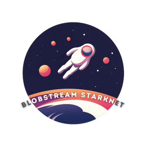

<div align="center">
  

  ***Where Modularism meets Integrity***

  [](https://github.com/keep-starknet-strange/blobstream-starknet/actions/workflows/check.yml)
  [](https://github.com/keep-starknet-strange/blobstream-starknet/actions/workflows/build.yml)

  [![Exploration_Team](https://img.shields.io/badge/Exploration_Team-29296E.svg?&style=for-the-badge&logo=data:image/svg%2bxml;base64,PD94bWwgdmVyc2lvbj0iMS4wIiBlbmNvZGluZz0iVVRGLTgiPz48c3ZnIGlkPSJhIiB4bWxucz0iaHR0cDovL3d3dy53My5vcmcvMjAwMC9zdmciIHZpZXdCb3g9IjAgMCAxODEgMTgxIj48ZGVmcz48c3R5bGU+LmJ7ZmlsbDojZmZmO308L3N0eWxlPjwvZGVmcz48cGF0aCBjbGFzcz0iYiIgZD0iTTE3Ni43Niw4OC4xOGwtMzYtMzcuNDNjLTEuMzMtMS40OC0zLjQxLTIuMDQtNS4zMS0xLjQybC0xMC42MiwyLjk4LTEyLjk1LDMuNjNoLjc4YzUuMTQtNC41Nyw5LjktOS41NSwxNC4yNS0xNC44OSwxLjY4LTEuNjgsMS44MS0yLjcyLDAtNC4yN0w5Mi40NSwuNzZxLTEuOTQtMS4wNC00LjAxLC4xM2MtMTIuMDQsMTIuNDMtMjMuODMsMjQuNzQtMzYsMzcuNjktMS4yLDEuNDUtMS41LDMuNDQtLjc4LDUuMThsNC4yNywxNi41OGMwLDIuNzIsMS40Miw1LjU3LDIuMDcsOC4yOS00LjczLTUuNjEtOS43NC0xMC45Ny0xNS4wMi0xNi4wNi0xLjY4LTEuODEtMi41OS0xLjgxLTQuNCwwTDQuMzksODguMDVjLTEuNjgsMi4zMy0xLjgxLDIuMzMsMCw0LjUzbDM1Ljg3LDM3LjNjMS4zNiwxLjUzLDMuNSwyLjEsNS40NCwxLjQybDExLjQtMy4xMSwxMi45NS0zLjYzdi45MWMtNS4yOSw0LjE3LTEwLjIyLDguNzYtMTQuNzYsMTMuNzNxLTMuNjMsMi45OC0uNzgsNS4zMWwzMy40MSwzNC44NGMyLjIsMi4yLDIuOTgsMi4yLDUuMTgsMGwzNS40OC0zNy4xN2MxLjU5LTEuMzgsMi4xNi0zLjYsMS40Mi01LjU3LTEuNjgtNi4wOS0zLjI0LTEyLjMtNC43OS0xOC4zOS0uNzQtMi4yNy0xLjIyLTQuNjItMS40Mi02Ljk5LDQuMyw1LjkzLDkuMDcsMTEuNTIsMTQuMjUsMTYuNzEsMS42OCwxLjY4LDIuNzIsMS42OCw0LjQsMGwzNC4zMi0zNS43NHExLjU1LTEuODEsMC00LjAxWm0tNzIuMjYsMTUuMTVjLTMuMTEtLjc4LTYuMDktMS41NS05LjE5LTIuNTktMS43OC0uMzQtMy42MSwuMy00Ljc5LDEuNjhsLTEyLjk1LDEzLjg2Yy0uNzYsLjg1LTEuNDUsMS43Ni0yLjA3LDIuNzJoLS42NWMxLjMtNS4zMSwyLjcyLTEwLjYyLDQuMDEtMTUuOGwxLjY4LTYuNzNjLjg0LTIuMTgsLjE1LTQuNjUtMS42OC02LjA5bC0xMi45NS0xNC4xMmMtLjY0LS40NS0xLjE0LTEuMDgtMS40Mi0xLjgxbDE5LjA0LDUuMTgsMi41OSwuNzhjMi4wNCwuNzYsNC4zMywuMTQsNS43LTEuNTVsMTIuOTUtMTQuMzhzLjc4LTEuMDQsMS42OC0xLjE3Yy0xLjgxLDYuNi0yLjk4LDE0LjEyLTUuNDQsMjAuNDYtMS4wOCwyLjk2LS4wOCw2LjI4LDIuNDYsOC4xNiw0LjI3LDQuMTQsOC4yOSw4LjU1LDEyLjk1LDEyLjk1LDAsMCwxLjMsLjkxLDEuNDIsMi4wN2wtMTMuMzQtMy42M1oiLz48L3N2Zz4=)](https://github.com/keep-starknet-strange)

</div>

## Overview

`blobstream_sn` is a port of Celestia Blobstream X [contracts](https://github.com/succinctlabs/blobstreamx)
in [Cairo](https://book.cairo-lang.org/) for [Starknet](https://starknet.io/).

See the book to dive down the [blobhole...](https://blobstream-stark.net)

## Build

To build the project, run:

```bash
scarb build
```

## Test

To test the project, run:

```bash
snforge test
```

## Bindings (Rust)

To build/update the bindings, first build the contract with `scarb`.

Then, within the Rust project `bindings/` run:

````bash
cargo build
````

## Contributors ✨

We live on contributions. If you'd like to contribute please follow the [guide](CONTRIBUTING.md).

<!-- ALL-CONTRIBUTORS-LIST:START - Do not remove or modify this section -->
<!-- prettier-ignore-start -->
<!-- markdownlint-disable -->
<table>
  <tbody>
    <tr>
      <td align="center" valign="top" width="14.28%"><a href="https://github.com/AbdelStark"><br /><sub><b>Abdel @ StarkWare </b></sub></a><br /><a href="https://github.com/keep-starknet-strange/blobstream-starknet/commits?author=AbdelStark" title="Code">💻</a></td>
      <td align="center" valign="top" width="14.28%"><a href="https://github.com/drspacemn"><br /><sub><b>drspacemn</b></sub></a><br /><a href="https://github.com/keep-starknet-strange/blobstream-starknet/commits?author=drspacemn" title="Code">💻</a></td>
      <td align="center" valign="top" width="14.28%"><a href="https://github.com/JordyRo1"><br /><sub><b>Jordy Romuald</b></sub></a><br /><a href="https://github.com/keep-starknet-strange/blobstream-starknet/commits?author=JordyRo1" title="Code">💻</a></td>
      <td align="center" valign="top" width="14.28%"><a href="https://github.com/ermvrs"><br /><sub><b>Erim</b></sub></a><br /><a href="https://github.com/keep-starknet-strange/blobstream-starknet/commits?author=ermvrs" title="Code">💻</a></td>
      <td align="center" valign="top" width="14.28%"><a href="https://www.linkedin.com/in/othman-sefraoui/"><br /><sub><b>OthmanSefraoui</b></sub></a><br /><a href="https://github.com/keep-starknet-strange/blobstream-starknet/commits?author=OthmanSefraoui" title="Code">💻</a></td>
      <td align="center" valign="top" width="14.28%"><a href="https://github.com/b-j-roberts"><br /><sub><b>Brandon R</b></sub></a><br /><a href="https://github.com/keep-starknet-strange/blobstream-starknet/commits?author=b-j-roberts" title="Code">💻</a></td>
      <td align="center" valign="top" width="14.28%"><a href="https://github.com/Akashneelesh"><br /><sub><b>Akashneelesh</b></sub></a><br /><a href="https://github.com/keep-starknet-strange/blobstream-starknet/commits?author=Akashneelesh" title="Code">💻</a></td>
    </tr>
    <tr>
      <td align="center" valign="top" width="14.28%"><a href="https://github.com/FlorianLgrs"><br /><sub><b>FlorianLgrs</b></sub></a><br /><a href="https://github.com/keep-starknet-strange/blobstream-starknet/commits?author=FlorianLgrs" title="Code">💻</a></td>
      <td align="center" valign="top" width="14.28%"><a href="https://github.com/ametel01"><br /><sub><b>Alex Metelli</b></sub></a><br /><a href="https://github.com/keep-starknet-strange/blobstream-starknet/commits?author=ametel01" title="Code">💻</a></td>
      <td align="center" valign="top" width="14.28%"><a href="https://github.com/faytey"><br /><sub><b>faytey</b></sub></a><br /><a href="https://github.com/keep-starknet-strange/blobstream-starknet/commits?author=faytey" title="Code">💻</a></td>
      <td align="center" valign="top" width="14.28%"><a href="https://github.com/remybar"><br /><sub><b>Rémy Baranx</b></sub></a><br /><a href="https://github.com/keep-starknet-strange/blobstream-starknet/commits?author=remybar" title="Code">💻</a></td>
      <td align="center" valign="top" width="14.28%"><a href="https://github.com/0xicosahedron"><br /><sub><b>Icosahedron</b></sub></a><br /><a href="https://github.com/keep-starknet-strange/blobstream-starknet/commits?author=0xicosahedron" title="Code">💻</a></td>
      <td align="center" valign="top" width="14.28%"><a href="https://github.com/thomas192"><br /><sub><b>0xK2</b></sub></a><br /><a href="https://github.com/keep-starknet-strange/blobstream-starknet/commits?author=thomas192" title="Code">💻</a></td>
    </tr>
  </tbody>
</table>

<!-- markdownlint-restore -->
<!-- prettier-ignore-end -->

<!-- ALL-CONTRIBUTORS-LIST:END -->

This project follows the [all-contributors](https://github.com/all-contributors/all-contributors) specification. Contributions of any kind welcome!
