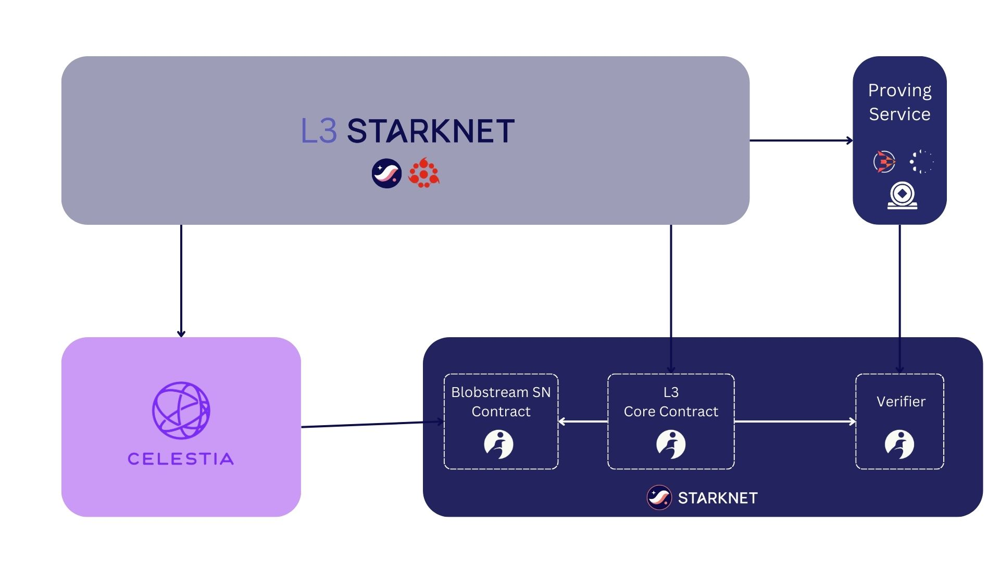

# Blobstream Starknet

Celestia -> Starknet messaging bridge via Cairo Blobstream contracts. 
Enables possibilities like Starknet L3s that use Celestia as a Data Availability layer.

Let's journey down the [blob hole](./getting-started)...
