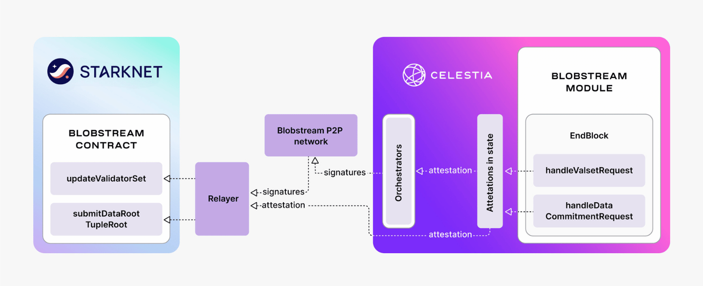

# Overview

Blobstream Starknet integrates Celestia's modular Data Availability layer with
Starknet, allowing L3s and dapps to submit DA to Celestia and then verify DA on
Starknet through Blobstream.

## Blobstream : Modular Data Availability Layer

[Blobstream](https://blog.celestia.org/introducing-blobstream/) is a solution
developed by Celestia Labs to stream Celestia's modular DA layer to Ethereum.
Blobstream relays commitments of Celestia's data root using an on-chain light
client. This enables Ethereum developers to create scalable L2s.

Celestia is based on Data Availability Sampling (DAS), which allows any user
to contribute to DA for rollups by running a sampling light node. As the light
node network grows, Celestia can scale without compromising security for end users.

To optimize Celestia as a DA layer, Succinct Labs contributed **Blobstream X**,
a zero-knowledge (ZK) implementation that uses a ZK light client to verify
Celestia validator signatures on-chain with a single ZK proof. This approach
reduces overhead for validators, simplifies the core Celestia protocol, and
enables faster streaming of data root commitments for Ethereum L2s.

## Why Starknet L3s should use Celestia

Several key differences highlight the advantages of using Celestia for DA.

### Scalability

With a modular approach to DA, Celestia maximizes data throughout by providing
dedicated blobspace that is priced independently of Ethereum gas costs and
unrelated execution. Also, by taking advantage of [DAS and erasure codings](https://hackmd.io/@vbuterin/sharding_proposal),
Celestia nodes can verify DA without checking all of the blob data posted.

### Decentralization and Transparency

Other DA solutions, such as [Data Availability Committees](https://celestia.org/glossary/data-availability-committee/),
introduce significant trust assumptions and liveness issues. This includes
relying on a small committee of nodes to not withhold data. Celestia decentralizes
the process by introducing a POS network where light nodes can detect if up to
two-thirds of validators withhold data or produce invalid blocks, holding them
accountable via slashing.

## How does it work

The Blobstream Starknet contracts are ported into Cairo from their
[Solidity counterparts](https://github.com/succinctlabs/blobstreamx), allowing
for more efficient and STARK-friendly execution.

L3s using Blobstream for DA verification must deploy a [core contract](./l3_starknet/core_contract.md)
onto Starknet L2. Starknet-like L3s could use [piltover](https://github.com/keep-starknet-strange/piltover),
a Cairo port for Starknet's L1 core contract.

Then the Starknet L3 can use Celestia as DA by :

- Posting blob data to Celestia
- Verifying the blobs DA on L2 via the [BlobstreamX contract](https://github.com/keep-starknet-strange/blobstream-starknet/blob/main/src/lib.cairo)

Useful links :

- [Solidity Blobstream X Contracts](https://github.com/succinctlabs/blobstreamx)
- [Cairo](https://book.cairo-lang.org/)
- [Starknet](https://docs.starknet.io/documentation)
